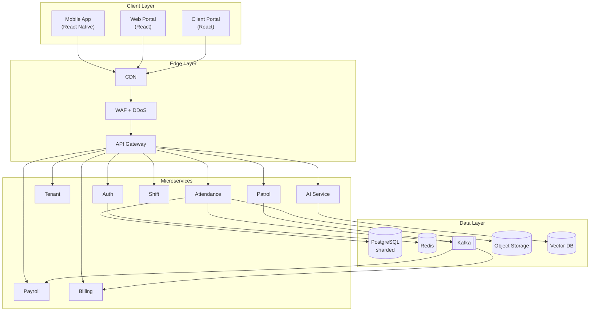

# WatchTower — Technical Architecture Documentation

> **Company:** Xentrix Solutions Pvt Ltd
> **Product:** WatchTower — Multi-Tenant Security Workforce Management SaaS
> **Document version:** 1.0
> **Status:** Engineering foundation — ready for sprint planning
> **Audience:** CTO, Product, Backend, Mobile, Frontend, DevOps, QA, AI teams

---

## How to use this documentation

This documentation set is structured as separate Markdown files so it can be maintained in version control (VS Code, Git) alongside the codebase. Each file is self-contained but cross-links to related sections. Diagrams use [Mermaid](https://mermaid.js.org/) which renders natively in GitHub, GitLab, and the VS Code Markdown Preview Mermaid extension.

### Recommended VS Code extensions

- **Markdown All in One** — TOC generation, preview
- **Markdown Preview Mermaid Support** — renders the architecture diagrams
- **markdownlint** — keeps formatting consistent across contributors

---

## Table of contents

| # | Document | Description |
|---|----------|-------------|
| 01 | [Project Overview](docs/01-project-overview.md) | Vision, scope, business model, multi-tenant hierarchy |
| 02 | [Functional Requirements](docs/02-functional-requirements.md) | Feature-level requirements per module |
| 03 | [Non-Functional Requirements](docs/03-non-functional-requirements.md) | Performance, scale, availability, security targets |
| 04 | [User Roles & Permissions](docs/04-roles-and-permissions.md) | RBAC + ABAC model, permission matrix |
| 05 | [Mobile Application Architecture](docs/05-mobile-architecture.md) | Single-app design, screens, offline, sync, GPS |
| 06 | [Web Admin Panel Architecture](docs/06-web-admin-architecture.md) | Three portals, menus, dashboards, dynamic loading |
| 07 | [Backend Architecture](docs/07-backend-architecture.md) | Microservices, responsibilities, events, communication |
| 08 | [Database Schema Design](docs/08-database-schema.md) | Multi-tenant data model, tables, ER diagrams |
| 09 | [API Documentation](docs/09-api-documentation.md) | REST conventions, key endpoints, error model |
| 10 | [Authentication & Authorization](docs/10-auth.md) | OTP, JWT, device binding, token lifecycle |
| 11 | [Notification System](docs/11-notifications.md) | Push, SMS, WhatsApp, email; fan-out architecture |
| 12 | [Attendance Management Module](docs/12-attendance.md) | 11 attendance methods, validation, fraud, sequences |
| 13 | [Security Guard Management Module](docs/13-guard-management.md) | Lifecycle, patrol, incident, shift, SOS |
| 14 | [Reporting & Analytics](docs/14-reporting-analytics.md) | Report engine, SLA dashboards, data pipeline |
| 15 | [Third-Party Integrations](docs/15-integrations.md) | Maps, SMS, biometrics, payroll, ERP |
| 16 | [Cloud Infrastructure (AWS/Azure)](docs/16-infrastructure.md) | Network topology, compute, data, observability |
| 17 | [CI/CD Pipeline](docs/17-cicd.md) | Branching, build, test, deploy, rollback |
| 18 | [Security & Compliance](docs/18-security-compliance.md) | Encryption, audit, DPDP, PSARA, threat model |
| 19 | [Deployment Guide](docs/19-deployment.md) | Environments, IaC, release process |
| 20 | [Folder Structure](docs/20-folder-structure.md) | Frontend, backend, mobile repo layouts |
| 21 | [Technology Stack](docs/21-tech-stack.md) | Chosen stack with rationale |
| 22 | [Future Enhancements](docs/22-future-enhancements.md) | AI roadmap, vertical expansion |

---

## System at a glance

---

## Document conventions

- **MUST / SHOULD / MAY** follow [RFC 2119](https://www.rfc-editor.org/rfc/rfc2119) semantics.
- Code identifiers, table names, and endpoints appear in `monospace`.
- All timestamps are stored in UTC; display localization happens client-side.
- All monetary values are in INR (paise as integer internally) unless stated.
- `tenant_id` scoping is implicit on every data-access path unless explicitly noted.

---

## Changelog

| Version | Date | Author | Notes |
|---------|------|--------|-------|
| 1.0 | 2025 | Architecture Team | Initial foundation document |
