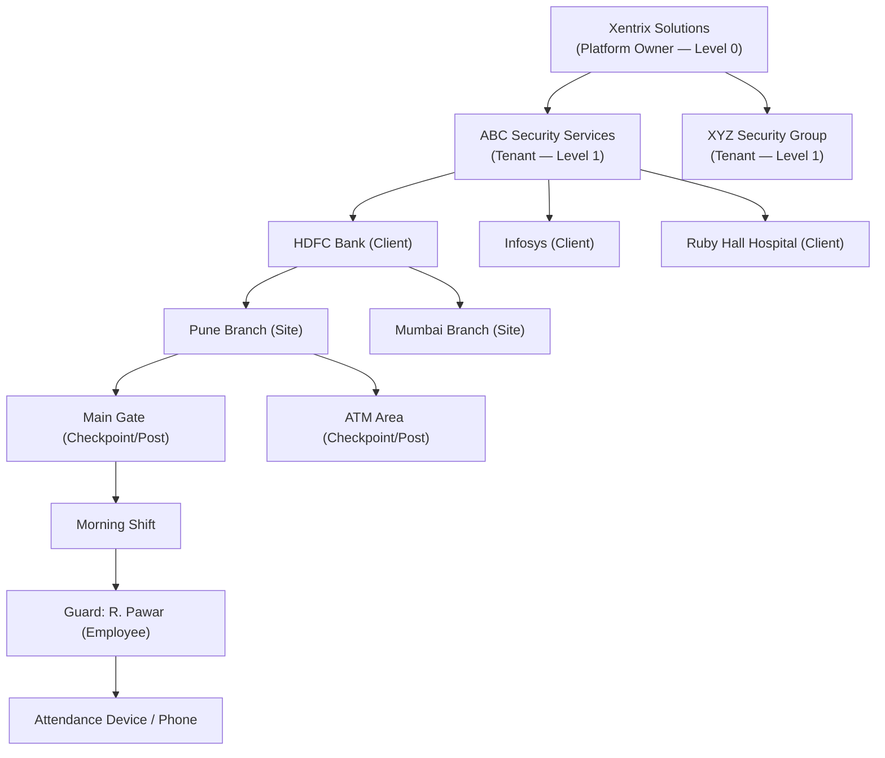
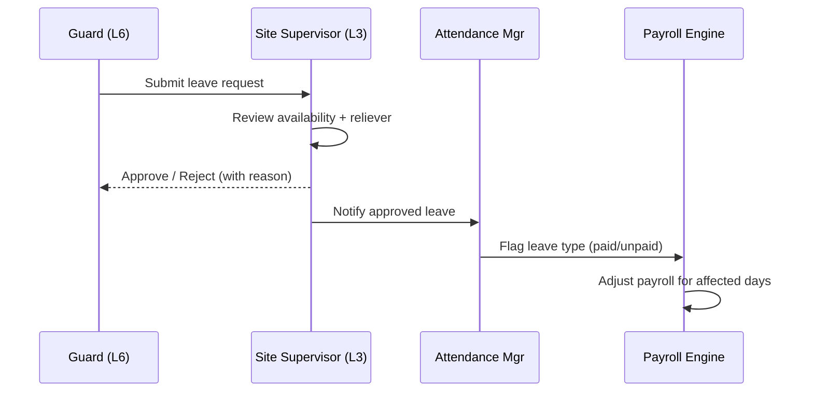

# 01 — Project Overview

[← Back to index](../README.md)

---

## 1.1 Vision

WatchTower is a multi-tenant SaaS platform that gives security guard companies a single operating system for their entire field workforce: recruitment, deployment, attendance, patrol verification, incident management, payroll, and client billing. Xentrix Solutions Pvt Ltd owns and operates the platform and sells subscriptions to security companies.

The platform competes with workforce management systems, attendance systems, and field-force tools, but is purpose-built for the security industry's specific needs: post-level deployment, patrol compliance as billable evidence, PSARA compliance, and the proxy-attendance fraud problem that plagues a low-trust, distributed workforce.

## 1.2 Business model

**Revenue:** subscription (per-guard-per-month at scale), usage-based AI add-ons, professional services. See [Functional Requirements §2.10](02-functional-requirements.md) for billing-engine scope.

## 1.3 Multi-tenant hierarchy (8 levels)

| Level | Entity | Owner | Data visibility | Reports up to |
|-------|--------|-------|-----------------|---------------|
| 0 | Xentrix | Xentrix | All tenants (governance only, DPA-bound) | — |
| 1 | Security Company (Tenant) | Tenant Owner | Entire tenant | Xentrix (billing only) |
| 2 | Client | Tenant (managed) | Own sites + deployed guards | Tenant |
| 3 | Site | Tenant / Site Supervisor | Own posts + guards | Client + Area Manager |
| 4 | Checkpoint / Post | Site | Own attendance + patrol | Site Supervisor |
| 5 | Shift | Site | Guards assigned to shift | Operations Manager |
| 6 | Employee (Guard) | Tenant HR | Own profile + records | Site Supervisor |
| 7 | Attendance Device | Tenant | Bound employee only | HR / Admin |

### Ownership and responsibility summary

- **Xentrix (L0)** owns the codebase, infrastructure, AI models, and tenant lifecycle. It never touches operational data except under signed Data Processing Agreements, and every such access is audit-logged.
- **Tenant (L1)** owns all operational data within its boundary. Complete isolation from other tenants is enforced at application and database layers.
- **Client (L2)** is a managed entity, not a paying WatchTower customer. A read-only Client User account may be provisioned.
- **Site → Post → Shift (L3–L5)** form the deployment skeleton. A guard is assigned to a Post for a Shift; this triple is the atomic operational unit for attendance and patrol.
- **Employee (L6)** records persist across site transfers; historical data is never orphaned.
- **Device (L7)** is bound 1:1 (configurable to 1:2) to an employee for fraud prevention.

### Approval flow (illustrative — leave request)

## 1.4 Scope

### In scope (this document)

End-to-end product and technical architecture: mobile app, three web portals, backend microservices, database, APIs, auth, notifications, attendance, guard management, reporting, integrations, cloud infra, CI/CD, security, deployment.

### Out of scope (this document)

Detailed UI visual design (handled by design system repo), legal contract templates, individual marketing pages, and per-state PSARA paperwork formats (tracked separately in compliance backlog).

## 1.5 Core design principles

1. **Tenant isolation is non-negotiable.** Every query is scoped by `tenant_id`; RLS is the backstop.
2. **Single mobile binary.** All roles use one app; behavior resolves dynamically post-login.
3. **Offline-first for the field.** Guards work where connectivity is poor; the app must function and sync.
4. **Event-driven core.** Attendance, patrol, and tracking generate events consumed asynchronously.
5. **AI as a first-class subsystem**, not a bolt-on — fraud detection and analytics are core value.
6. **Compliance by construction** — PF, ESI, PSARA, DPDP handled in the engines, not in spreadsheets.

## 1.6 Glossary

| Term | Meaning |
|------|---------|
| Tenant | A security company that subscribes to WatchTower |
| Client | An organization a tenant provides guards to |
| Site | A physical location under a client |
| Post / Checkpoint | A specific guarding position within a site |
| Shift | A time-bounded duty window at a post |
| Reliever | On-call guard who covers absences |
| Geofence | Virtual boundary around a site for location validation |
| SLA | Service Level Agreement between tenant and client |
| RLS | Row-Level Security (PostgreSQL) |
| DPDP | Digital Personal Data Protection Act, 2023 (India) |
| PSARA | Private Security Agencies Regulation Act, 2005 (India) |
