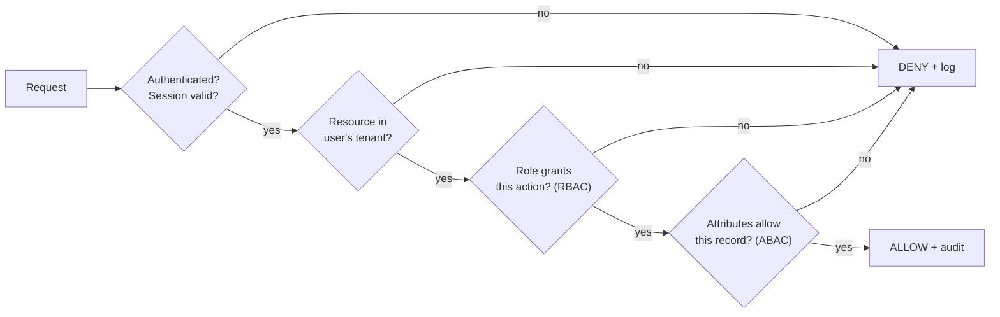
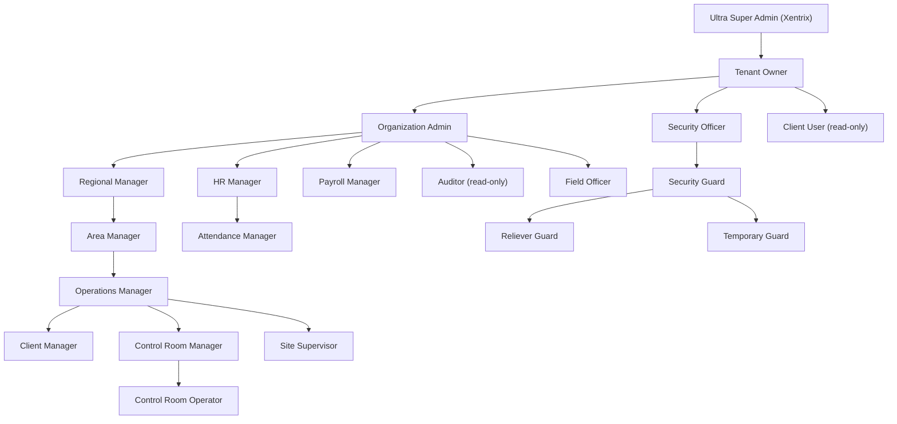

# 04 — User Roles & Permissions

[← Back to index](../README.md)

---

## 4.1 Access model: RBAC + ABAC

WatchTower combines **Role-Based Access Control** (static permissions per role) with **Attribute-Based Access Control** (dynamic scoping by hierarchy position).



**RBAC** answers "can this *role* perform this *action type*?"
**ABAC** answers "can this *specific user* touch this *specific record*?" — e.g., a Site Supervisor may approve attendance (RBAC yes) but only for guards at their assigned site (ABAC scope).

## 4.2 Role hierarchy



## 4.3 Role catalog

| Role | Data scope | Primary authority |
|------|-----------|-------------------|
| Ultra Super Admin | All tenants (DPA-bound) | Platform governance, tenant lifecycle |
| Tenant Owner | Entire tenant | Payroll/contract/billing final approval |
| Organization Admin | Entire tenant | Operations, config, invoicing |
| Regional Manager | Region | Sites in region, emergency deployment |
| Area Manager | Site cluster | Deployment, attendance exception approval |
| Operations Manager | Client portfolio | Scheduling, incident assignment |
| Client Manager | Assigned clients | SLA, invoice prep, client relations |
| Control Room Manager | All active sites | Live monitoring, escalation |
| Control Room Operator | All sites (read) | Alert handling, incident creation |
| Site Supervisor | Assigned sites | On-ground attendance, patrol, incidents |
| Attendance Manager | All attendance | Corrections, exceptions, leave |
| HR Manager | All employees | Lifecycle, documents, compliance |
| Payroll Manager | Payroll | Run, bank file, payslips |
| Auditor | Read-only all | Compliance review |
| Field Officer | Assigned sites | On-ground verification |
| Security Officer | Own + post | Senior guard duties + reporting |
| Security Guard | Own only | Attendance, schedule, SOS |
| Reliever Guard | Temp site | Cover absences |
| Temporary Guard | Minimal | Attendance only |
| Client User | Own org (read) | SLA dashboard, reports |

## 4.4 Permission matrix (representative)

| Capability | Guard | Supervisor | Ops Mgr | HR | Payroll | Org Admin | Tenant Owner |
|-----------|:-----:|:----------:|:-------:|:--:|:-------:|:---------:|:------------:|
| Mark own attendance | ✅ | ✅ | ✅ | ❌ | ❌ | ✅ | ✅ |
| Approve attendance exception | ❌ | ✅* | ✅* | ✅ | ❌ | ✅ | ✅ |
| View all guards | ❌ | site* | client* | ✅ | ✅ | ✅ | ✅ |
| Create payroll run | ❌ | ❌ | ❌ | ❌ | ✅ | ✅ | ✅ |
| Approve payroll run | ❌ | ❌ | ❌ | ❌ | ❌ | ✅ | ✅ |
| Manage clients/sites | ❌ | ❌ | ✅ | ❌ | ❌ | ✅ | ✅ |
| Create/approve invoice | ❌ | ❌ | ❌ | ❌ | ❌ | ✅ | ✅ |
| Configure white-label | ❌ | ❌ | ❌ | ❌ | ❌ | ✅ | ✅ |
| Trigger SOS | ✅ | ✅ | ✅ | ✅ | ✅ | ✅ | ✅ |
| View AI insights | ❌ | ❌ | ✅ | ✅ | ✅ | ✅ | ✅ |

`*` = ABAC-scoped to the user's site/client/region.

## 4.5 Permission representation (technical)

Permissions are expressed as `resource:action` strings (e.g., `attendance:approve`, `invoice:create`). Roles map to permission sets; the Permission Service resolves the effective set at login and caches it in the JWT claims (coarse) plus a server-side check (fine + ABAC) on every sensitive call.

```json
{
  "role": "SITE_SUPERVISOR",
  "permissions": ["attendance:read", "attendance:approve", "incident:create", "patrol:read"],
  "scope": {
    "type": "SITE",
    "site_ids": ["site_abc_001", "site_abc_002"]
  }
}
```

ABAC scope objects (`TENANT`, `REGION`, `CLIENT`, `SITE`, `SELF`) are evaluated server-side against the target record. Never trust client-supplied scope.
