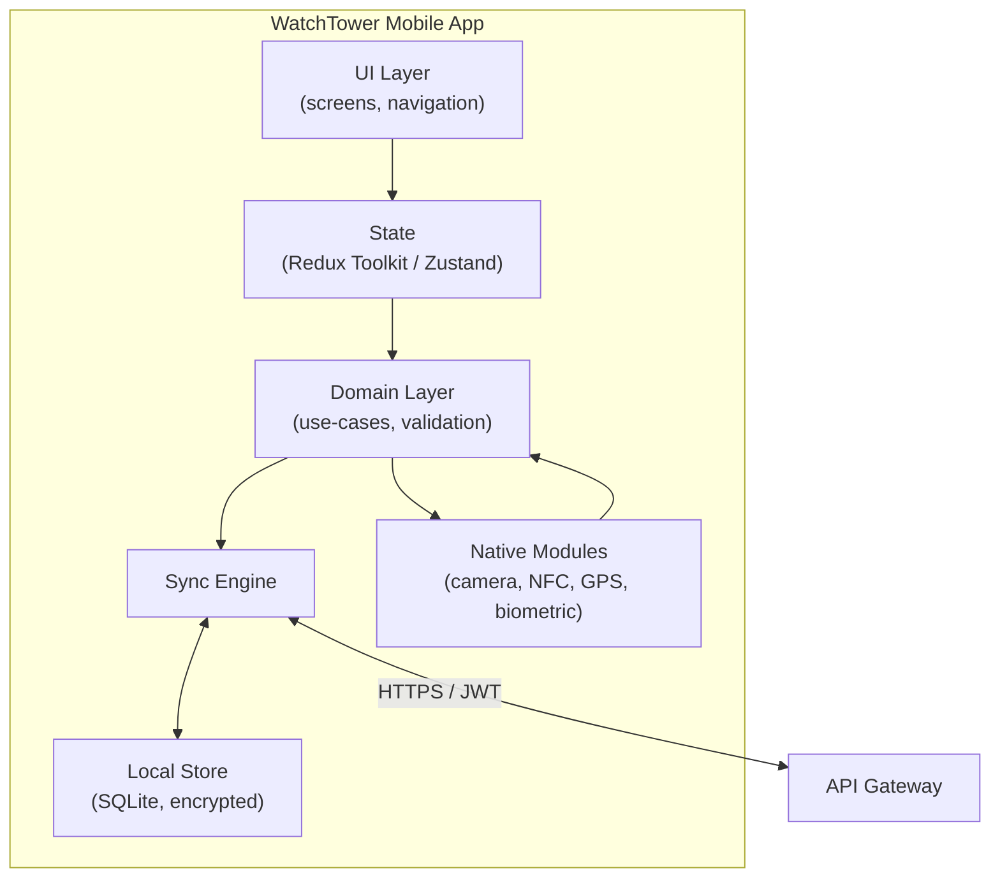
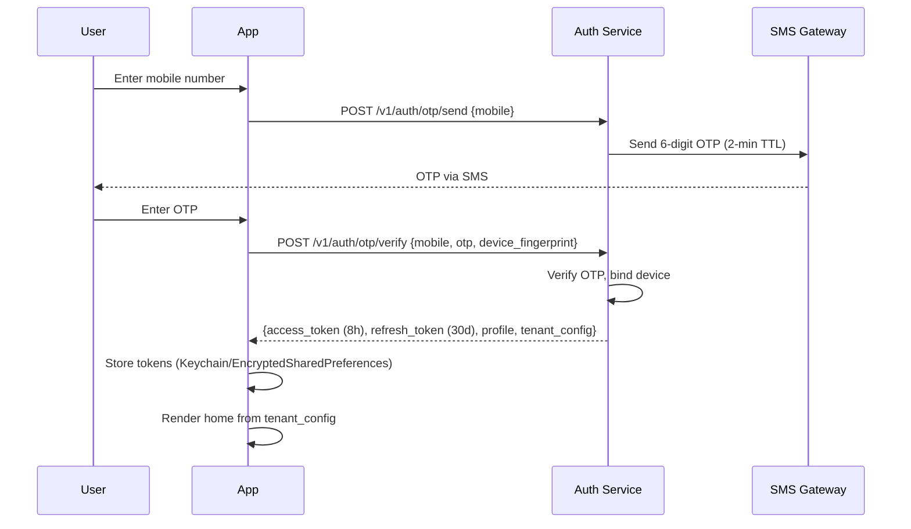
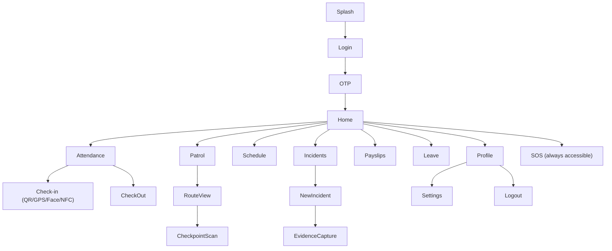

# 05 — Mobile Application Architecture

[← Back to index](../README.md)

---

## 5.1 Philosophy

One binary on Play Store and App Store. All roles — guard, supervisor, manager, control room, client user — use the same app. After authentication, the app resolves tenant, branding, role, modules, permissions, and dashboards dynamically from the server.

**Stack:** React Native (see [21](21-tech-stack.md)) with TypeScript, native modules for camera/NFC/biometrics/background-location.

## 5.2 High-level architecture



## 5.3 Login & session flows

### OTP login (guards)



### Email login (managers)

`POST /v1/auth/login {email, password}` → if MFA enabled, server returns `mfa_required`; client posts `POST /v1/auth/mfa/verify {totp}` → tokens issued. See [10](10-auth.md) for token lifecycle.

### Device registration

On first OTP login the app captures a device fingerprint (model, OS, app version, install ID). The Auth Service records `employee_id ↔ device_id`. A subsequent login from a new device triggers a re-verification workflow requiring HR approval. Default policy: 1 device per guard (configurable to 2).

## 5.4 Dynamic configuration

The login response includes the config that drives the entire UI:

```json
{
  "role": "SECURITY_GUARD",
  "enabled_modules": ["ATTENDANCE","PATROL","SCHEDULE","PAYSLIPS","LEAVE","INCIDENT"],
  "dashboard_widgets": ["TODAY_SHIFT","ATTENDANCE_STATUS","PATROL_SCHEDULE","LEAVE_BALANCE","SOS"],
  "permissions": ["attendance:write","incident:create","patrol:read"],
  "branding": {
    "app_name": "ABC Guard",
    "primary_color": "#1A237E",
    "logo_url": "https://cdn.watchtower.app/t/abc/logo.png"
  },
  "feature_flags": { "face_attendance": true, "voice_attendance": false }
}
```

Navigation tabs, menu items, and home widgets are built from `enabled_modules` + `dashboard_widgets`. A `ThemeProvider` injects `branding` at runtime — no rebuild needed for branding changes.

## 5.5 Screen hierarchy



### Role-conditional surfaces

| Role | Additional screens |
|------|--------------------|
| Site Supervisor | Attendance approval queue, guard roster, site dashboard |
| Control Room Operator | Live map, alert feed, incident queue |
| HR Manager | Onboarding pipeline, document expiry, leave admin |
| Client User | SLA dashboard, patrol logs, incident view (own org) |

## 5.6 Offline mode & sync engine

```mermaid
sequenceDiagram
    participant App
    participant Q as Local Sync Queue (SQLite)
    participant API
    Note over App: Offline — guard scans QR
    App->>Q: Enqueue attendance event (device_ts, gps, payload)
    Note over App: Connectivity restored
    loop every 30s while queue not empty
        App->>API: POST /v1/sync/batch [events]
        API-->>App: per-event {accepted | conflict | rejected}
        App->>Q: Remove accepted; flag conflicts for review
    end
```

**Offline-capable:** QR/NFC attendance, viewing cached schedule and patrol route, drafting incidents.
**Conflict resolution:** server timestamp is canonical; device timestamp stored for audit; idempotency by client-generated `event_id`.
**Storage:** SQLite encrypted with a device-derived key. On rooted/jailbroken devices, offline attendance is disabled to defeat GPS spoofing tools.

## 5.7 GPS tracking & battery optimization

- Background location via native module; **adaptive sampling**: 1 update/5 min when stationary, 1 update/1 min when moving.
- Geofence exit during shift raises an event to the Tracking Service → Control Room alert.
- Batch upload of location points (every N minutes) to reduce radio wake-ups and data cost.
- Respects OS background-location permissions; clear in-app disclosure of tracking during duty only.

## 5.8 Patrol verification (mobile)

Guard opens the active route → app shows ordered checkpoints → scans QR/NFC or walks GPS waypoints → each scan records `{checkpoint_id, ts, gps, round_number}` → app shows live round progress (`● ● ○ ○`). Out-of-sequence scans are flagged locally and server-side.

## 5.9 Incident & SOS

- **Incident:** category + severity + narrative + evidence (photos ≤10, video ≤3 compressed). Drafts persist offline; evidence uploads resume on reconnect.
- **SOS:** 3-second press-and-hold (prevents accidental triggers) → immediate event to Notification + Incident services → Control Room flashing alert with live GPS → escalation chain (see [13](13-guard-management.md)).

## 5.10 Push notifications

FCM (Android) / APNs (iOS). Device tokens registered per `{employee_id, device_id, tenant_id}`. Categories: shift reminder, patrol-due, leave outcome, payslip published, and (supervisor) absent-guard / exception / incident / SOS alerts.

## 5.11 Mobile security controls

- Certificate pinning (defeats MITM on corporate proxies).
- Root/jailbreak detection (blocks offline attendance; warns admin).
- Screenshot prevention on payslip and guard-list screens.
- Biometric app lock after 5 minutes idle (no re-OTP).
- Runtime app-signature/tamper check.
