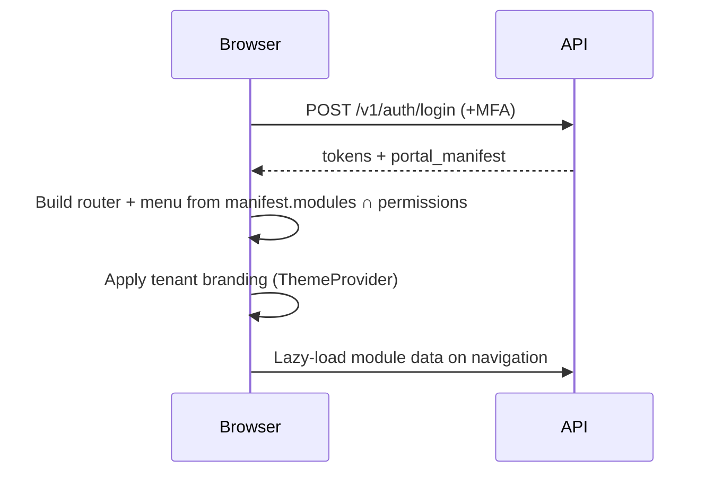
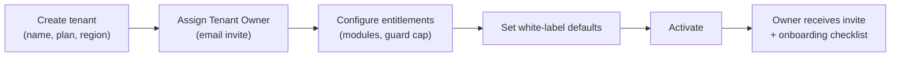
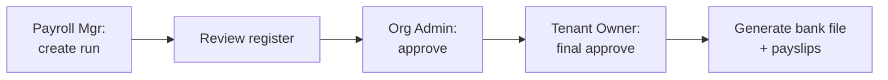
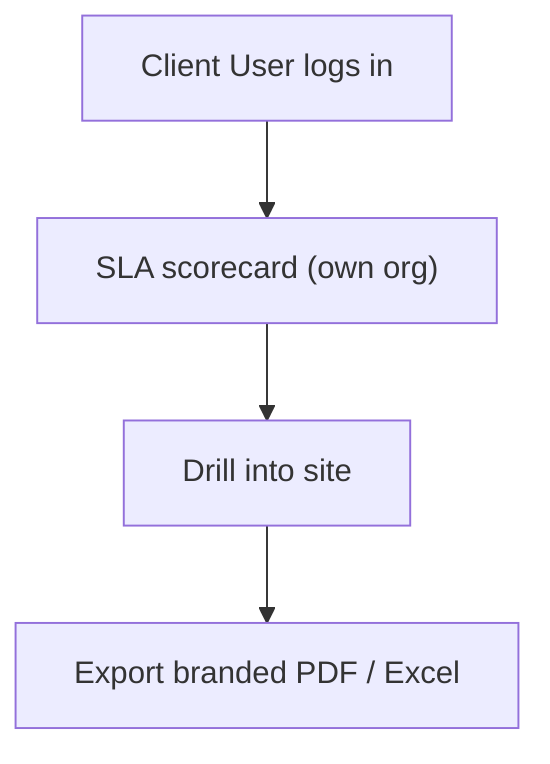

# 06 — Web Admin Panel Architecture

[← Back to index](../README.md)

---

## 6.1 Three portals, one codebase

All three portals are built from a shared React component library and design system. The portal a user sees is resolved from their role at login. **Stack:** React + TypeScript, Vite, TanStack Query, a component library (see [21](21-tech-stack.md)).

| Portal | Audience | Auth |
|--------|----------|------|
| Xentrix Portal | Ultra Super Admin, platform staff | Email + MFA (mandatory) |
| Tenant Portal | Tenant Owner → Site Supervisor | Email + MFA (Org Admin+) |
| Client Portal | Client User | Email + MFA, read-only |

## 6.2 Dynamic module loading

After login, the web app fetches a portal manifest analogous to the mobile config: enabled modules, menu tree, permissions, branding. Routes and menu items render only if the user's permission set includes them. Lazy-loaded route bundles keep initial load small.



## 6.3 Xentrix Portal (Ultra Super Admin)

### Menu

```
Dashboard
Tenants
  ├─ All Tenants
  ├─ Provision Tenant
  └─ Suspended / Expired
Subscriptions & Billing
  ├─ Plans
  ├─ Tenant Subscriptions
  └─ Platform Invoices
Feature Management
  ├─ Feature Flags
  └─ Module Catalog
White Label & Theme
Global Analytics
Global Reports
Platform Monitoring
Security Monitoring
AI Controls
  ├─ Model Versions
  ├─ Fairness Audits
  └─ Inference Usage
```

### Dashboard

Tenant count and growth, MRR/ARR, platform uptime, active guards platform-wide, AI inference volume, security alerts feed, top tenants by usage.

### User journey (provision a tenant)



## 6.4 Tenant Portal (Security Company)

### Menu

```
Dashboard
Clients
Sites & Posts
Employees
  ├─ Directory
  ├─ Onboarding
  ├─ Documents
  └─ Transfers / Exits
Attendance
  ├─ Live Status
  ├─ Exceptions
  └─ Corrections
Shifts & Roster
Patrol
Incidents
Payroll
Billing & Invoices
Reports
Analytics
Settings
  ├─ Roles & Users
  ├─ White Label
  └─ Notification Rules
```

### Dashboard (Org Admin / Tenant Owner)

Revenue vs cost, active guards, active clients/sites, SLA compliance, attrition risk (AI), open incidents, today's attendance rate.

### Approval workflows surfaced here

- Attendance exceptions (Supervisor / Attendance Manager)
- Leave requests (Supervisor → HR)
- Payroll run (Payroll Mgr → Org Admin → Tenant Owner)
- Invoice (Client Mgr → Org Admin)
- Guard transfer / suspension / termination



## 6.5 Client Portal (read-only)

### Menu

```
Dashboard (SLA scorecard)
Attendance Reports
Guard Reports
Site Reports
Incident Reports
SLA Reports
Analytics
```

### Dashboard

Per-site post coverage vs SLA, patrol compliance, incident response time, guard availability, open incidents, last patrol time. PII beyond name + employee ID is masked.



## 6.6 Cross-portal permissions matrix

| Module | Xentrix | Tenant | Client |
|--------|:-------:|:------:|:------:|
| Tenant management | ✅ | ❌ | ❌ |
| Subscriptions/billing (platform) | ✅ | ❌ | ❌ |
| Client/site/employee CRUD | ❌ | ✅ | ❌ |
| Attendance ops | ❌ | ✅ | read |
| Payroll | ❌ | ✅ | ❌ |
| Client billing | ❌ | ✅ | view own invoices |
| Reports | global | tenant-wide | own org |
| AI controls | ✅ | consume | ❌ |

## 6.7 Frontend best practices

- **Server state** via TanStack Query (caching, retries, optimistic updates); **UI state** local.
- **Permission-aware components:** a `<Can permission="invoice:create">` guard wraps actionable UI; never rely on hiding alone — the API re-checks.
- **Code-split by route/module**; prefetch on hover for snappy navigation.
- **Type-safe API client** generated from the OpenAPI spec ([09](09-api-documentation.md)).
- **Tenant theming** via CSS variables set from branding config.
- **Accessibility:** WCAG 2.1 AA; keyboard navigation; visible focus.
