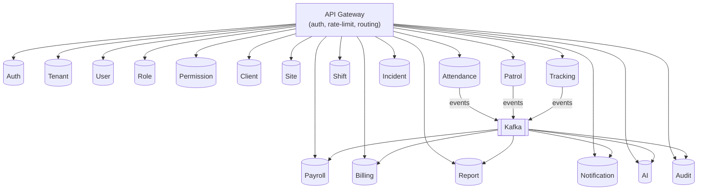
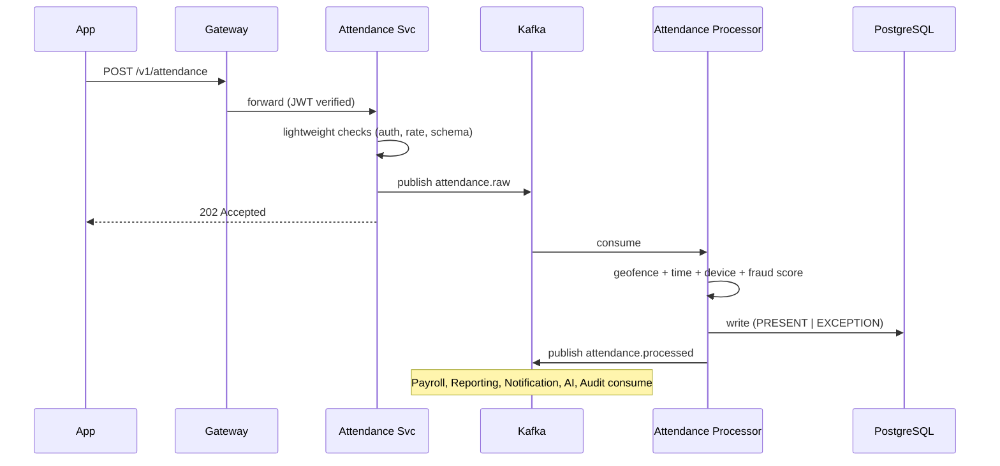

# 07 — Backend Architecture

[← Back to index](../README.md)

---

## 7.1 Style

Event-driven microservices. Synchronous REST/gRPC for request/response; Kafka for asynchronous, high-volume, and cross-service workflows. Each service owns its data (database-per-service logical ownership; physically co-located on shared clusters for standard tenants).

## 7.2 Service catalog

| Service | Responsibilities | Owns (tables) | Key events |
|---------|------------------|---------------|-----------|
| **Auth** | Login, OTP, MFA, JWT issue/refresh, device binding | sessions, devices, otp_challenges | `user.logged_in`, `device.registered` |
| **Tenant** | Tenant lifecycle, subscriptions, entitlements, white-label | tenants, subscriptions, feature_flags | `tenant.created`, `subscription.changed` |
| **User** | Employee records, lifecycle, documents | employees, documents, employee_status_history | `employee.onboarded`, `employee.terminated` |
| **Role** | Role definitions | roles, role_assignments | `role.assigned` |
| **Permission** | Permission sets, ABAC scope resolution | permissions, role_permissions | — |
| **Client** | Clients, contracts | clients, contracts | `client.created`, `contract.signed` |
| **Site** | Sites, posts, checkpoints, geofences | sites, posts, checkpoints | `site.created`, `post.created` |
| **Attendance** | Ingest + validate all 11 methods, exceptions | attendance_events, exceptions | `attendance.recorded`, `attendance.exception` |
| **Shift** | Shift config, rosters, swaps, scheduling | shifts, rosters, roster_assignments | `roster.published`, `shift.swapped` |
| **Patrol** | Routes, checkpoint scans, compliance | patrol_routes, patrol_events | `patrol.completed`, `patrol.missed` |
| **Incident** | Incidents, evidence, escalation, RCA | incidents, evidence, escalations | `incident.created`, `sos.triggered` |
| **Tracking** | Live GPS, geofence eval, travel history | location_events (time-series) | `geofence.exit`, `location.update` |
| **Payroll** | Calculation, statutory, runs, payslips | payroll_runs, payslips, salary_structures | `payroll.completed`, `payslip.published` |
| **Billing** | Invoice generation, SLA penalties, payments | invoices, invoice_lines, payments | `invoice.generated`, `payment.received` |
| **Report** | Report generation, scheduling, exports | report_defs, report_runs | `report.ready` |
| **Notification** | Push/SMS/WhatsApp/email fan-out | notification_log, device_tokens | `notification.sent` |
| **AI** | Face recognition, fraud, prediction, chat | embeddings (vector), model_registry | `fraud.flagged`, `prediction.ready` |
| **Audit** | Immutable audit log ingestion | audit_log (append-only) | consumes all `*` events |

## 7.3 Communication patterns

- **Synchronous (REST/gRPC):** user-facing reads and writes that need an immediate response (e.g., create client, fetch dashboard). API Gateway routes by path; service-to-service calls use gRPC with mTLS inside the mesh.
- **Asynchronous (Kafka):** attendance/patrol/tracking ingestion, payroll/billing aggregation, notifications, AI scoring, and audit. Decouples write spikes from downstream processing.
- **Saga / choreography** for multi-service workflows (e.g., termination → payroll F&F → device unbind → archive) using events + compensating actions; no distributed 2-phase commit.

## 7.4 Attendance write path (high-scale)

Throughput: peak ~500 events/s at shift change; Kafka provisioned for 1,000/s; 10-consumer group at 50/s each; PostgreSQL partitioned writes.

## 7.5 Resilience patterns

- **Idempotency:** every event carries a client/server `event_id`; consumers dedupe.
- **Retry with backoff:** 1s → 5s → 30s → 5min, then Dead Letter Queue + on-call alert.
- **Circuit breakers** on outbound third-party calls (SMS, e-KYC, maps).
- **Bulkheads:** AI (GPU) and report generation run in isolated pools so they can't starve the attendance path.
- **Graceful degradation:** if e-KYC is down, onboarding proceeds with a flag; if face match is down, attendance falls back to QR.

## 7.6 Service template (every service ships with)

- Health/readiness endpoints (`/healthz`, `/readyz`)
- Structured JSON logging with correlation IDs
- OpenTelemetry tracing
- Prometheus metrics (RED)
- Config via environment + secrets manager (no secrets in code)
- Standard error envelope (see [09](09-api-documentation.md))
- Tenant-context middleware that injects and enforces `tenant_id`
