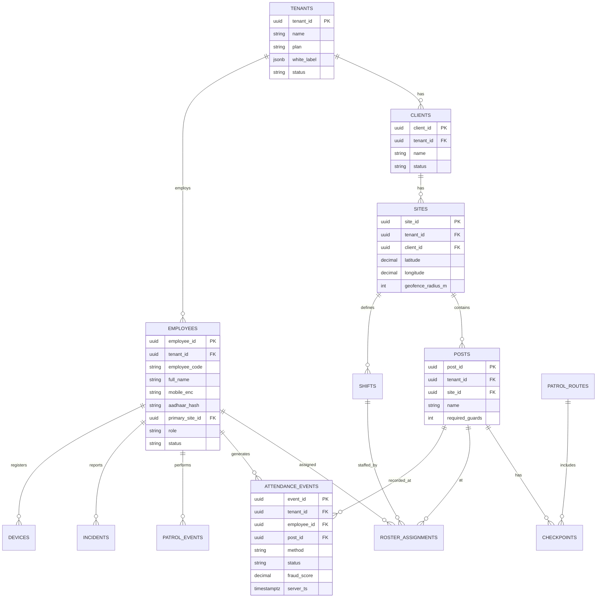
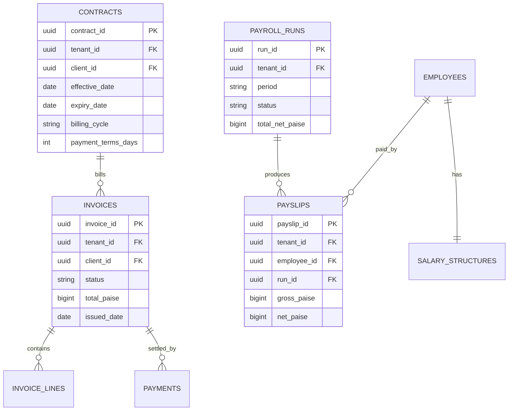

# 08 — Database Schema Design

[← Back to index](../README.md)

---

## 8.1 Multi-tenancy strategy

**Shared database, shared schema, `tenant_id` on every table, enforced by Row-Level Security (RLS)** for standard tenants. Enterprise tenants (>50k employees) may opt into a **dedicated schema or database** for physical isolation.

```sql
-- RLS backstop (application also filters by tenant_id)
ALTER TABLE attendance_events ENABLE ROW LEVEL SECURITY;
CREATE POLICY tenant_isolation ON attendance_events
  USING (tenant_id = current_setting('app.tenant_id')::uuid);
```

The application sets `app.tenant_id` per connection/transaction from the authenticated context. RLS ensures a bug in the query layer cannot leak cross-tenant data.

## 8.2 Sharding & partitioning

- **Shard** by `hash(tenant_id)` — ~1,000–2,000 tenants per shard; 3 read replicas per shard.
- **Partition** high-volume tables by `(tenant_id, year, month)`:

```sql
CREATE TABLE attendance_events (
  event_id        uuid PRIMARY KEY,
  tenant_id       uuid NOT NULL,
  employee_id     uuid NOT NULL,
  post_id         uuid NOT NULL,
  -- ...
  server_ts       timestamptz NOT NULL
) PARTITION BY RANGE (server_ts);

-- Monthly partitions created ahead of time by a scheduled job
CREATE TABLE attendance_events_2025_03
  PARTITION OF attendance_events
  FOR VALUES FROM ('2025-03-01') TO ('2025-04-01');
```

Old partitions are detached and moved to cold storage after 12 months.

## 8.3 Core ER diagram



## 8.4 Billing / payroll ER diagram



## 8.5 Key table definitions

### `employees`

| Column | Type | Notes |
|--------|------|-------|
| employee_id | uuid PK | |
| tenant_id | uuid FK | RLS key |
| employee_code | varchar(20) | human-readable |
| full_name | varchar(100) | |
| mobile_enc | bytea | AES-256 encrypted |
| aadhaar_hash | char(64) | SHA-256; never plaintext |
| date_of_birth | date | |
| status | enum | ONBOARDING/ACTIVE/SUSPENDED/TERMINATED |
| primary_site_id | uuid FK | |
| role | varchar(50) | |
| joined_at | timestamptz | |
| terminated_at | timestamptz | null if active |
| created_at / updated_at | timestamptz | |

### `attendance_events`

| Column | Type | Notes |
|--------|------|-------|
| event_id | uuid PK | client-generated for idempotency |
| tenant_id | uuid FK | RLS key |
| employee_id | uuid FK | |
| post_id | uuid FK | |
| event_type | enum | CHECK_IN / CHECK_OUT |
| method | enum | QR/GPS/FACE/NFC/RFID/BIOMETRIC/WIFI/VOICE/MANUAL/AI |
| device_id | varchar(100) | |
| latitude / longitude | decimal | |
| gps_accuracy_m | decimal | |
| server_ts | timestamptz | canonical time |
| device_ts | timestamptz | for drift detection |
| status | enum | VALID/EXCEPTION/FRAUD_FLAGGED |
| fraud_score | decimal(4,3) | 0.000–1.000 |

### `audit_log` (append-only)

| Column | Type |
|--------|------|
| audit_id | uuid PK |
| tenant_id | uuid |
| user_id | uuid |
| action | enum (CREATE/UPDATE/DELETE/APPROVE/REJECT/LOGIN/EXPORT) |
| entity_type | varchar |
| entity_id | uuid |
| old_value | jsonb |
| new_value | jsonb |
| ip_address | inet |
| created_at | timestamptz |

## 8.6 Indexing strategy

```sql
-- Hot query: an employee's attendance over time
CREATE INDEX ix_att_emp_ts ON attendance_events (tenant_id, employee_id, server_ts DESC);
-- Hot query: a post's attendance
CREATE INDEX ix_att_post_ts ON attendance_events (tenant_id, post_id, server_ts DESC);
-- Approval queue (small subset)
CREATE INDEX ix_att_exception ON attendance_events (tenant_id, status)
  WHERE status = 'EXCEPTION';
```

## 8.7 Storage tiering

| Tier | Store | Age | Latency |
|------|-------|-----|---------|
| Hot | PostgreSQL primary | current month | <10 ms |
| Warm | PostgreSQL older partitions | ≤12 months | <100 ms |
| Cold | Object storage (Parquet export) | >12 months | <5 s |
| Archive | WORM object storage | >3 years | minutes |

## 8.8 Backup & DR

- **Backups:** automated daily full + continuous WAL archiving; tested monthly restore.
- **Cross-region:** async streaming replication to a secondary region.
- **RTO 4h / RPO 1h.** Quarterly DR game-day: promote secondary, run smoke tests.
- **Audit logs and archives** are immutable (WORM) and excluded from any delete path.
