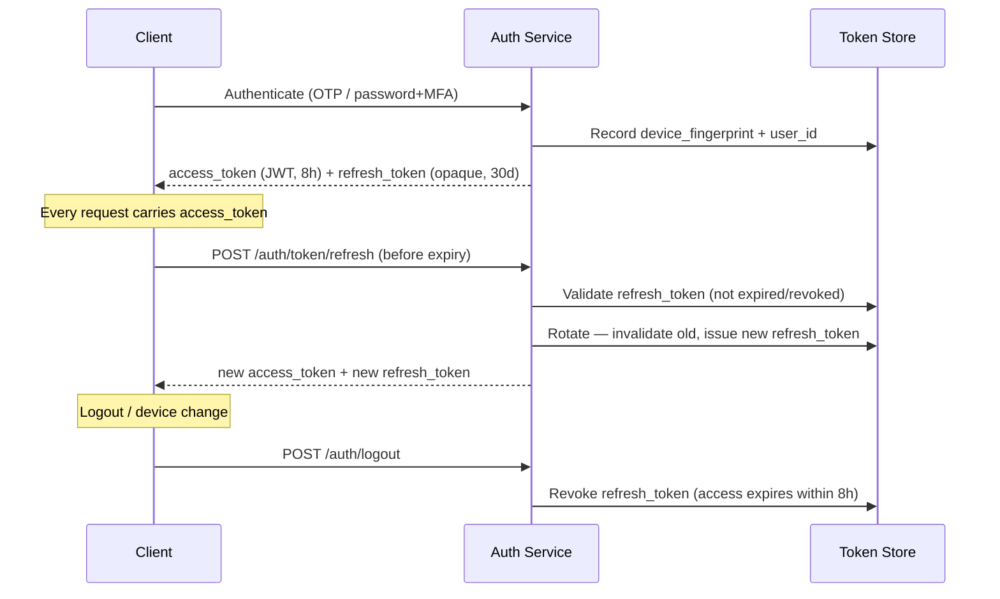
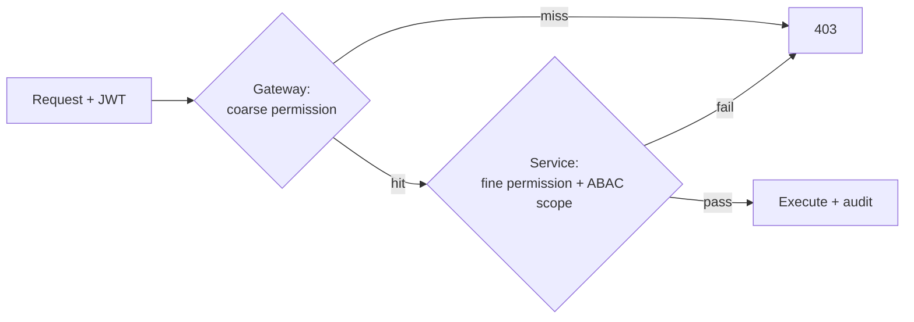

# 10 — Authentication & Authorization

[← Back to index](../README.md)

---

## 10.1 Authentication methods

| User type | Primary | Second factor | Session |
|-----------|---------|---------------|---------|
| Security Guards | Mobile + OTP | Biometric app unlock | 8h access / 30d refresh |
| Managers/Admins | Email + password (bcrypt ≥10 rounds) | TOTP (mandatory Org Admin+) | 8h access / 30d refresh |
| Enterprise | SAML 2.0 / OIDC SSO | IdP-enforced | per corporate policy |
| Client Users | Email + password | TOTP | 8h access |

## 10.2 Token lifecycle

- **Access token (JWT):** carries `sub`, `tenant_id`, `role`, coarse `permissions`, `device_id`, `exp`. Signed with rotating asymmetric keys (RS256); public keys exposed via JWKS.
- **Refresh token:** opaque, stored server-side, single-use (rotation). Reuse detection revokes the whole token family (defends against theft).
- **Device binding:** the JWT's `device_id` must match the request's device fingerprint; mismatch → `DEVICE_NOT_REGISTERED`.

## 10.3 OTP security

- 6 digits, 2-minute TTL, max 3 attempts, then lockout + cooldown.
- OTP hashed at rest; never logged.
- Rate-limited per mobile number and per IP.
- Multi-provider SMS fallback so OTP delivery survives a single gateway outage.

## 10.4 Authorization (RBAC + ABAC)

See [04 — Roles & Permissions](04-roles-and-permissions.md) for the model. At runtime:

1. **Coarse check at gateway:** does the JWT's permission set include `resource:action`? (fast reject)
2. **Fine check in service:** re-resolve permissions server-side (JWT could be stale) and evaluate ABAC scope against the target record.

## 10.5 Session management

- Idle timeout on web (configurable, default 30 min); biometric re-lock on mobile after 5 min.
- Concurrent-session policy configurable per tenant (e.g., one active web session for finance roles).
- All active sessions visible to the user; remote logout supported.

## 10.6 Encryption & key management

- Passwords: bcrypt. OTP/refresh tokens: hashed. PII columns: AES-256 (envelope encryption).
- Keys in AWS KMS / Azure Key Vault; per-tenant data keys; annual rotation.
- No secrets in code or images; injected at runtime from the secrets manager.

## 10.7 Threats addressed

| Threat | Control |
|--------|---------|
| Credential stuffing | Rate limits, MFA, anomalous-login alerts |
| Token theft | Short access TTL, refresh rotation + reuse detection, device binding |
| Proxy / shared device | Device binding, root detection, face verification |
| MITM | TLS 1.3, certificate pinning |
| Privilege escalation | Server-side fine permission re-check, ABAC scoping |
| Replay | Idempotency keys, nonce on sensitive actions |
