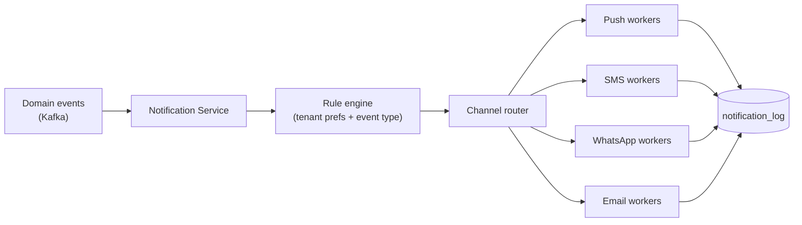

# 11 — Notification System

[← Back to index](../README.md)

---

## 11.1 Channels

| Channel | Provider (primary / fallback) | Use |
|---------|------------------------------|-----|
| Push | FCM (Android) / APNs (iOS) | In-app alerts, real-time ops |
| SMS | Multi-provider (e.g., MSG91 / Twilio) | OTP, critical alerts |
| WhatsApp | WhatsApp Business API (BSP) | Reminders for low-app-engagement guards |
| Email | Transactional ESP (SES / SendGrid) | Reports, payslips, invoices, digests |

## 11.2 Architecture

The Notification Service consumes domain events, applies per-tenant routing rules, dedupes, throttles, and dispatches via channel-specific worker pools. Delivery status is written to `notification_log` for audit and retry.

## 11.3 Event → notification mapping (examples)

| Event | Recipients | Channels |
|-------|-----------|----------|
| `shift.reminder` (T-1h) | Assigned guard | Push, WhatsApp |
| `attendance.exception` | Site Supervisor | Push |
| `patrol.missed` | Supervisor → Area Mgr (escalation) | Push, SMS |
| `sos.triggered` | Control Room, Supervisor, Area Mgr | Push, SMS, (call trigger) |
| `leave.decided` | Guard | Push |
| `payslip.published` | Guard | Push, WhatsApp |
| `invoice.generated` | Client Manager | Email |
| `report.ready` | Requesting user | Email, Push |

## 11.4 Preferences & throttling

- Per-tenant notification rules and per-user channel preferences.
- Quiet hours respected except for P1/SOS.
- Rate limiting and digesting (e.g., batch low-priority alerts into a daily summary) to avoid notification fatigue.
- Localized message templates (Hindi/English) selected by user locale.

## 11.5 Reliability

- At-least-once delivery; idempotent by `notification_id`.
- Retry with backoff per channel; permanent failures (invalid token, opted-out number) recorded and surfaced to admins.
- Provider failover: SMS/WhatsApp configured with secondary BSPs; health checks drive routing.

## 11.6 Token management

Device push tokens registered on login (`{employee_id, device_id, tenant_id, platform, token}`), refreshed by the app, invalidated on logout/device-change. Stale tokens pruned on `NotRegistered` responses from FCM/APNs.
