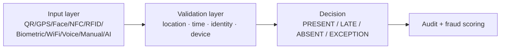
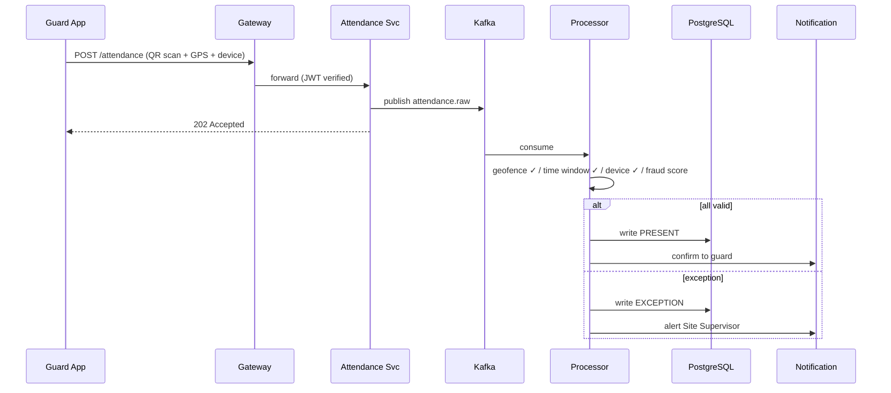
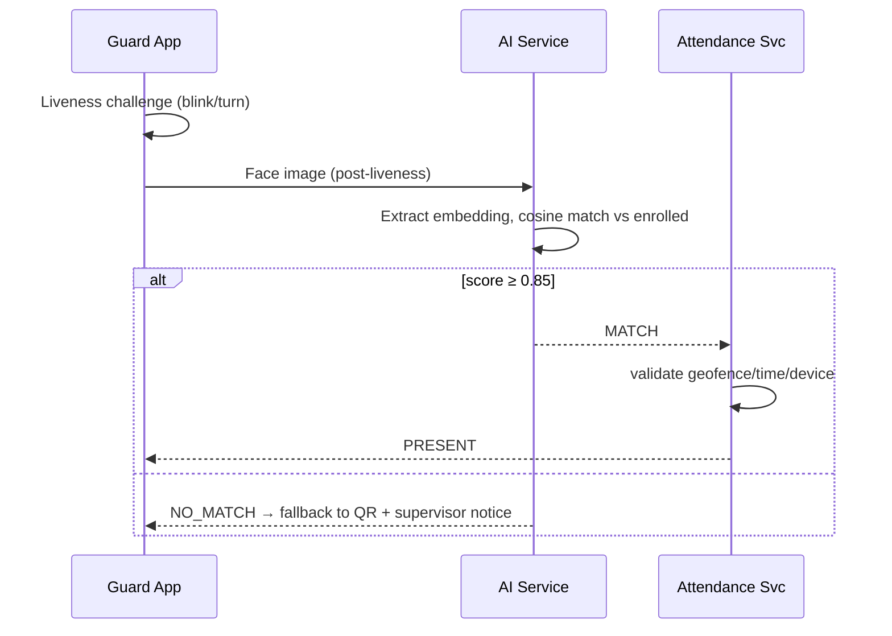
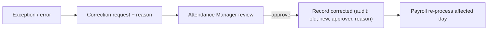

# 12 — Attendance Management Module

[← Back to index](../README.md)

---

## 12.1 Engine overview

The attendance engine determines whether a guard was present at the right post, at the right time, in a verified way, with fraud controls.

## 12.2 Method comparison

| Method | Best for | Validation | Fraud control |
|--------|----------|-----------|---------------|
| QR | Most sites (primary) | QR id + geofence + time + device | Rotating/TOTP QR, GPS cross-check |
| GPS | Outdoor/perimeter | Geofence polygon/circle | Spoofing detection via sensors |
| Geofence | Auto check-in zones | Enter/exit fence events | Accuracy threshold gating |
| RFID | Access-controlled entry | Card UID → employee | Card bound in DB |
| NFC | Indoor/basement/parking | Tag UID + time | Tag UID binding |
| Biometric | Fixed terminals | Hardware match | Hardware-level uniqueness |
| Face | High-security/compliance | Embedding match ≥0.85 | Liveness detection |
| WiFi | Indoor, weak GPS | Known SSID/BSSID | MAC binding |
| Voice | Feature phones | IVR + voice print (roadmap) | Voice biometric |
| Manual | Emergency fallback | Supervisor OTP | Dual approval, audit-flagged |
| AI | CCTV-integrated | Server-side face match | Stream liveness |

## 12.3 Attendance states & payroll impact

| State | Payroll impact |
|-------|----------------|
| PRESENT | Full day |
| LATE_IN | Full (configurable deduction) |
| LATE_IN_HALF_DAY | Half day |
| ABSENT | No pay |
| HALF_DAY_LEAVE | Half leave |
| ON_LEAVE | Leave type deducted |
| HOLIDAY | Holiday rules |
| EARLY_EXIT | Rule-based deduction |
| EXCEPTION_PENDING | Frozen until resolved |
| COMP_OFF | Comp-off credit |

## 12.4 QR check-in sequence

## 12.5 Face check-in sequence

## 12.6 Validation logic

For every event the processor checks, in order:
1. **Identity** — method-specific (QR id mapped to active post QR, face match, device binding).
2. **Location** — within site geofence (accuracy-gated; WiFi fallback if GPS poor).
3. **Time** — within shift window + grace; after late cutoff → LATE_IN_HALF_DAY.
4. **Device** — fingerprint matches the bound device.
5. **Fraud score** — anomaly model output; high score → FRAUD_FLAGGED for review.

Any failure → `EXCEPTION` (not silent reject) so a human can resolve and nothing is lost.

## 12.7 Fraud detection

| Pattern | Signal |
|---------|--------|
| Proxy attendance | Face mismatch; one device, many employees |
| Buddy punching | Identical GPS for multiple guards at low-density site |
| GPS spoofing | GPS vs network-location vs motion-sensor inconsistency |
| Time manipulation | device_ts vs server_ts drift beyond tolerance |
| QR screenshot reuse | TOTP-style rotating QR, reuse detection |

Unsupervised anomaly model (Isolation Forest) scores each event on features: time delta, location accuracy, device consistency, check-in sequence, shift alignment. See [14 §Analytics](14-reporting-analytics.md) and AI in [22](22-future-enhancements.md).

## 12.8 Offline handling

Events cached in encrypted SQLite, synced in order via `POST /attendance/sync/batch`. Server validates with 5-minute drift tolerance; idempotent by `event_id`; conflicts surfaced for supervisor review.

## 12.9 Correction & audit

Every correction writes an immutable `audit_log` entry; payroll for the affected day is recomputed if the period isn't locked.
