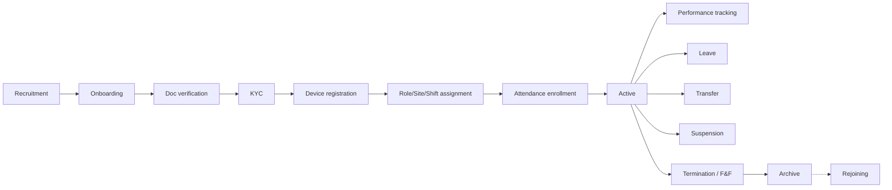
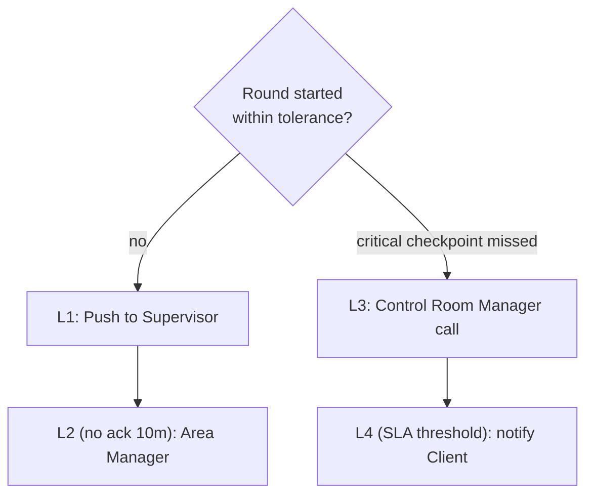
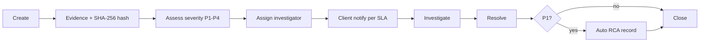
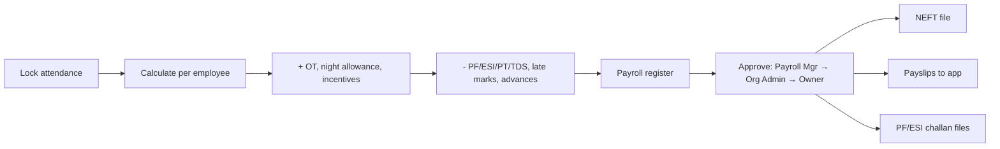
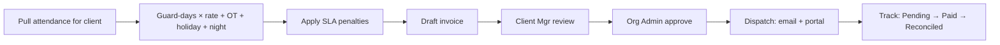
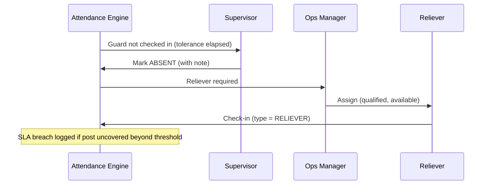

# 13 — Security Guard Management Module

[← Back to index](../README.md)

Covers employee lifecycle, shifts, patrol, incidents, SOS, payroll, and billing as they relate to the guard workforce.

---

## 13.1 Employee lifecycle



Mandatory onboarding documents (India): Aadhaar, PAN, PSARA training certificate, police verification, previous-employment NOC, bank proof, medical fitness, education proof. Deployment is blocked until VERIFIED (configurable 7-day grace with a visible flag). Document expiry alerts fire 60 days out.

## 13.2 Shift management

| Type | Description |
|------|-------------|
| Fixed | Same window daily |
| Rotational | Weekly rotation Morning/Afternoon/Night |
| Split | Two segments with a gap |
| Night | Night allowance triggered |
| Flexible | Start within a window, fixed hours |

**Roster conflict rules (block publish):** overlapping shifts, >48h/week, <8h rest between shifts, leave-vs-assignment, unstaffed post. **Swap:** requires equivalent qualifications, no new overtime, 24h notice (configurable), supervisor approval.

```mermaid
sequenceDiagram
    participant A as Guard A
    participant B as Guard B
    participant S as Supervisor
    A->>B: Request swap (date X)
    B-->>A: Accept
    A->>S: Swap pending
    S-->>A: Approve (qualifications + no-OT checks pass)
    Note over A,B: Both rosters updated; attendance engine re-pointed
```

## 13.3 Patrol management

Routes hold up to 50 ordered checkpoints (QR/NFC/GPS) with time windows and a per-shift frequency. The compliance engine evaluates each round and escalates:



Metrics: compliance rate, checkpoint coverage, average duration, missed/late/out-of-sequence counts. Detail mirrors [02 §2.6](02-functional-requirements.md).

## 13.4 Incident management

Categories: security breach, theft, fire/safety, medical, violence, vandalism, suspicious activity, equipment failure, SOS, near-miss. Severity P1–P4 drives response SLA and client-notification timing.



## 13.5 SOS workflow

```mermaid
sequenceDiagram
    participant G as Guard
    participant N as Notification
    participant CR as Control Room
    participant SUP as Supervisor
    participant AM as Area Manager
    G->>N: SOS (3s hold) + live GPS
    N->>CR: Flashing P1 alert
    N->>CR: SMS to Control Room Manager
    CR->>G: Operator calls within 60s
    alt no response 2m
        CR->>SUP: Escalate (call)
    end
    alt still no response
        CR->>AM: Escalate; emergency services (100/112)
    end
    Note over CR: All actions timestamped in incident record
```

## 13.6 Payroll (guard-facing)



Statutory: PF 12%+12% (8.33% EPS + 3.67% EPF), ESI 0.75%+3.25% (gross <₹21k), Professional Tax (state slab), Gratuity provision (15/26 × Basic per year, payable after 5y). Each run is immutable and audited.

## 13.7 Client billing (guard-derived)

Billing reads locked attendance + shift logs at cycle end:



Billing models: per-guard, per-shift, per-day, attendance-based, monthly, with overtime/holiday/SLA-penalty modifiers. Per-client profitability = revenue − (salaries + PF/ESI + gratuity provision + uniform + training); margin alerts trigger renegotiation review.

## 13.8 Reliever flow (absence)


