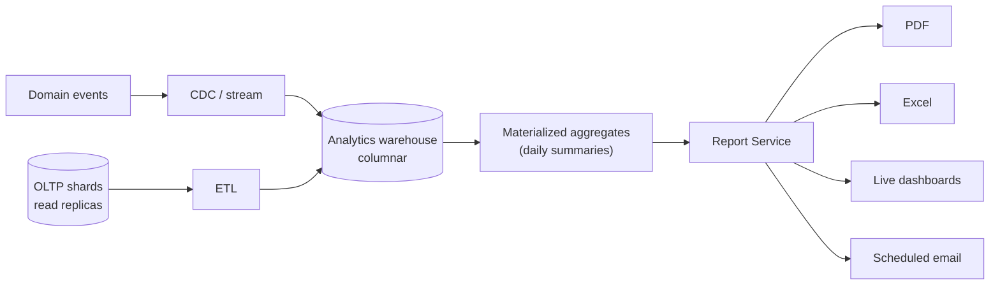

# 14 — Reporting & Analytics

[← Back to index](../README.md)

---

## 14.1 Report categories

| Category | Examples | Audience |
|----------|----------|----------|
| Operational | Daily attendance, deployment status, patrol compliance, absent list | Supervisor, Ops Mgr, Control Room |
| HR | Manpower strength, attrition, training/document compliance, leave balance | HR Manager |
| Financial | Payroll register, PF/ESI challan, invoice report, revenue vs cost, outstanding dues | Payroll Mgr, Tenant Owner |
| Compliance | PSARA registers, SLA penalty report | Tenant Owner, Client Mgr |
| Executive | Business overview, attrition risk, margin | Tenant Owner |
| Client-facing | SLA scorecard, incident summary, patrol logs | Client User |

## 14.2 Reporting architecture

Reporting queries hit **read replicas / the warehouse**, never the OLTP primary. Daily summaries are precomputed as materialized views (refreshed nightly / every 15 min for near-real-time tiles). Heavy or custom reports run as async jobs and notify the user when ready.

## 14.3 Delivery formats

- **In-app dashboards** with drill-down.
- **PDF** — tenant-branded, printable.
- **Excel** — raw data for finance.
- **Scheduled email** — configurable recipients/frequency.
- **API** — tenants pull report data into their own BI/ERP.

## 14.4 SLA dashboard (client-facing)

Real-time tiles per site: post coverage vs SLA, patrol compliance, incident response time, guard availability, open incidents, last patrol time. Breaches highlighted. Backed by materialized aggregates so the client view is fast and consistent.

## 14.5 Custom report builder

Drag-and-drop: choose data source (attendance/guards/incidents/patrol/billing) → fields → filters (date, site, client, shift) → aggregations → charts → save → schedule. Generated queries are sandboxed, tenant-scoped, and resource-limited.

## 14.6 Embedded analytics & AI insights

- **Attendance trends, overtime cost, attrition risk** surfaced on the executive dashboard.
- **Fraud scores** aggregated into a fraud-watch report for Ops.
- **Demand forecast** (roadmap) feeds capacity planning. See [22](22-future-enhancements.md).

## 14.7 Best practices

- Separate read models from write models (CQRS) for heavy reporting paths.
- Precompute the expensive aggregates; never compute dashboards at request time at scale.
- Tenant-scope and resource-cap every ad-hoc query.
- Version report definitions so a changed report doesn't silently alter historical exports.
