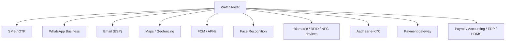
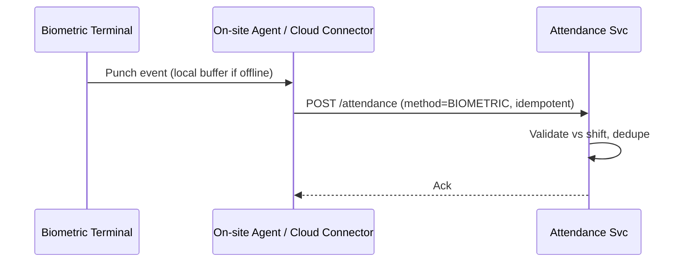

# 15 — Third-Party Integrations

[← Back to index](../README.md)

---

## 15.1 Integration map

## 15.2 Integration details

| Domain | Why | Flow | Cost notes | Enterprise alternatives |
|--------|-----|------|-----------|-------------------------|
| **SMS / OTP** | Guard auth, critical alerts | App → Auth Svc → SMS API → handset | Per-message; OTP-heavy | MSG91, Twilio, Kaleyra; multi-provider failover |
| **WhatsApp** | Reminders for low-app-engagement guards | Notification Svc → BSP → user | Per-conversation (template msgs) | Meta BSPs: Gupshup, Twilio, Wati |
| **Email (ESP)** | Reports, payslips, invoices | Report/Billing → ESP → recipient | Per-email; cheap | Amazon SES, SendGrid, Postmark |
| **Maps / Geofencing** | Attendance/tracking validation, live map | App SDK + server geocoding/geofence | Per-request map loads | Google Maps Platform, Mapbox; self-host tiles at scale |
| **Push** | Real-time ops alerts | Notification Svc → FCM/APNs → device | Free | FCM/APNs (no alternative) |
| **Face recognition** | Identity verification, anti-proxy | App captures → AI Svc embedding match | Self-hosted = infra cost; API = per-call | Self-host (ArcFace) preferred for cost + data control; AWS Rekognition as fallback |
| **Biometric / RFID / NFC** | Hardware attendance at fixed sites | Device → local agent / cloud connector → Attendance Svc | Hardware capex | ZKTeco, eSSL, Suprema |
| **Aadhaar e-KYC** | Onboarding identity verification | User Svc → KYC provider (OTP/DigiLocker) | Per-verification | UIDAI-licensed KSAs, DigiLocker |
| **Payment gateway** | Tenant subscription collection (Xentrix→Tenant) | Tenant portal → gateway → reconcile | % per transaction | Razorpay, Stripe, PayU |
| **Payroll/Accounting/ERP/HRMS** | Bidirectional employee + finance sync | Connector / webhooks / file exchange | Build + maintenance | Tally, Zoho, SAP, Keka, Darwinbox |

## 15.3 Integration principles

- **Adapter pattern:** each external dependency sits behind an internal interface so providers can be swapped without touching business logic.
- **Circuit breakers + timeouts** on every outbound call; degrade gracefully (e.g., onboarding continues with a flag if e-KYC is down).
- **Idempotent + retried** delivery for messaging; record provider message IDs for reconciliation.
- **Secrets** for all third-party credentials live in the secrets manager, rotated regularly.
- **Webhooks in** (e.g., payment status, device events) are signature-verified and idempotent.

## 15.4 Biometric device connectivity

Devices buffer punches offline and sync on reconnect; the connector guarantees idempotent delivery so reconnects don't double-count.
