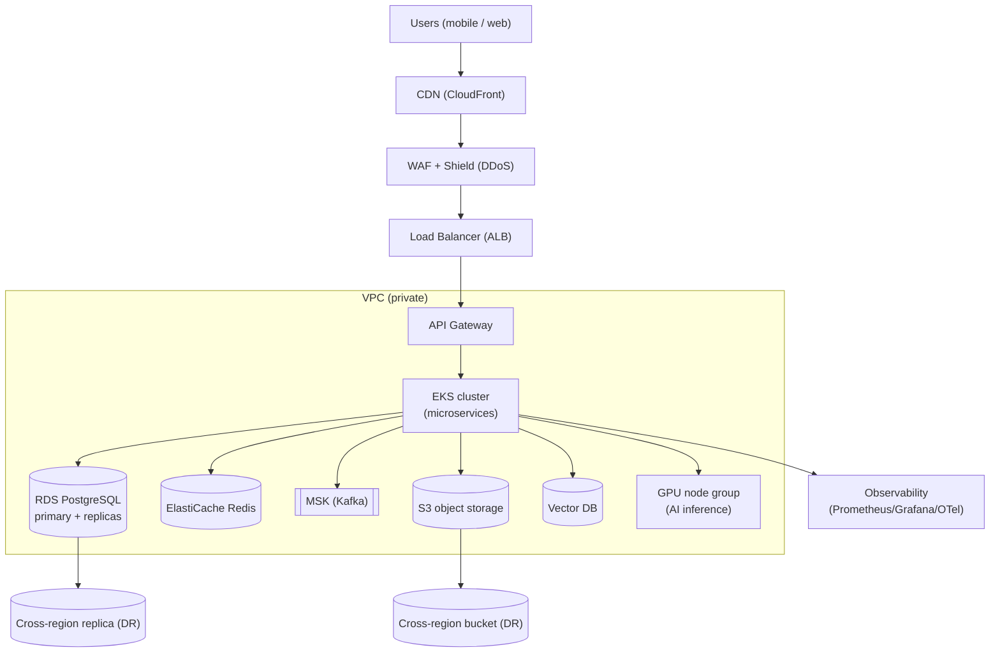

# 16 — Cloud Infrastructure (AWS / Azure)

[← Back to index](../README.md)

This document uses AWS service names; Azure equivalents are listed in §16.7. Data residency: India region by default (DPDP).

---

## 16.1 High-level topology

## 16.2 Network

- **VPC** with public subnets (ALB, NAT) and private subnets (EKS, data).
- Only the ALB/CDN are internet-facing; all services and data are private.
- Security groups least-privilege; service-to-service traffic over the cluster mesh with mTLS.
- VPC endpoints for S3/KMS to keep traffic off the public internet.

## 16.3 Compute

- **EKS (Kubernetes)** runs all stateless microservices; Horizontal Pod Autoscaler on CPU + queue depth; cluster autoscaler for nodes.
- Separate **node groups**: general (services), memory-optimized (reporting/cache), **GPU** (AI inference) — bulkheaded so AI/reporting can't starve attendance.
- Min 3 replicas per service across 2 AZs.

## 16.4 Data layer

| Concern | Service | Notes |
|---------|---------|-------|
| OLTP | RDS PostgreSQL (sharded) | primary + 3 read replicas/shard; Multi-AZ |
| Cache/session | ElastiCache Redis | cluster mode; sessions, shift configs |
| Streaming | MSK (Kafka) | attendance/patrol/tracking/notifications |
| Objects | S3 | documents, evidence, exports; SSE-KMS |
| Vector | managed/self-hosted vector DB | face embeddings per tenant namespace |
| Warehouse | columnar (Redshift / managed) | analytics, reporting aggregates |
| Archive | S3 Glacier (WORM) | 7-year compliance retention |

## 16.5 Edge & delivery

- **CloudFront** serves web app static assets and signed media URLs.
- **WAF** rules (OWASP top 10, rate-based) + **Shield** for DDoS.
- TLS termination at the edge; TLS 1.3; HSTS.

## 16.6 Observability & secrets

- **Metrics:** Prometheus + Grafana; **logs:** centralized (OpenSearch/CloudWatch); **traces:** OpenTelemetry.
- **Alerting:** SLO burn-rate alerts → on-call (PagerDuty/Opsgenie); runbooks linked.
- **Secrets:** AWS Secrets Manager + KMS; per-tenant data keys; rotation enforced.

## 16.7 Azure equivalents

| AWS | Azure |
|-----|-------|
| CloudFront | Azure Front Door / CDN |
| WAF + Shield | Azure WAF + DDoS Protection |
| ALB | Azure Load Balancer / App Gateway |
| EKS | AKS |
| RDS PostgreSQL | Azure Database for PostgreSQL (Flexible) |
| ElastiCache | Azure Cache for Redis |
| MSK | Event Hubs (Kafka) / HDInsight Kafka |
| S3 | Blob Storage |
| Glacier | Blob Archive tier |
| Redshift | Synapse Analytics |
| Secrets Manager + KMS | Key Vault |
| CloudWatch | Azure Monitor |

## 16.8 High availability & DR

- Multi-AZ for compute and RDS; automated failover.
- Cross-region async replication for RDS and S3; **RTO 4h / RPO 1h**.
- Quarterly DR game-day: promote secondary region, run smoke tests.
- Chaos testing in staging (node kill, network partition, dependency latency).

## 16.9 Scalability mechanics

- Stateless services scale horizontally; attendance spikes absorbed by Kafka, not the DB.
- DB scales by sharding (more shards as tenants grow) + read replicas.
- Reporting offloaded to the warehouse; AI to GPU pools.
- Multi-region active-passive at platform scale; active-active is a future option for global tenants.
