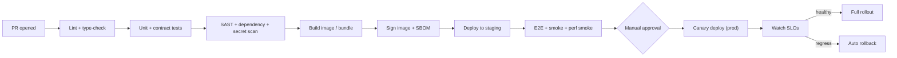

# 17 — CI/CD Pipeline

[← Back to index](../README.md)

---

## 17.1 Branching strategy

Trunk-based with short-lived feature branches and PRs. `main` is always releasable. Release tags drive deployments. Hotfixes branch from the release tag and merge back to `main`.

## 17.2 Pipeline overview

## 17.3 Stages

| Stage | Tooling (suggested) | Gate |
|-------|---------------------|------|
| Lint/type | ESLint, tsc, golangci-lint | must pass |
| Unit | Jest / Vitest / Go test | ≥80% on logic packages |
| Contract | Pact / schema tests vs OpenAPI | code↔spec parity |
| Security | SAST, `npm audit`/`govulncheck`, secret scan, container scan | no high/critical |
| Build | Docker buildx, multi-arch | reproducible |
| Supply chain | Cosign signing + SBOM (Syft) | signed images only deployable |
| Deploy | Helm + Argo CD (GitOps) | environment-scoped |
| E2E | Playwright (web), Detox (mobile), API e2e | must pass on staging |
| Perf smoke | k6 against staging | within budget |

## 17.4 Environments

| Env | Purpose | Data |
|-----|---------|------|
| Dev | Per-developer / ephemeral | synthetic |
| Staging | Pre-prod, full integration | anonymized/synthetic |
| Prod | Live | real (encrypted) |

Promotion is image-immutable: the artifact tested in staging is the exact artifact deployed to prod (no rebuild).

## 17.5 Deployment strategy

- **Canary** rollout with automated SLO watch (error rate, latency, saturation); auto-rollback on regression.
- **Blue-green** for risky DB-coupled releases.
- **Online schema migrations** (e.g., `pg-osc`/expand-contract) — never a blocking `ALTER` on 100M-row tables; backward-compatible migrations decoupled from code deploy.

## 17.6 Mobile delivery

- CI builds signed Android/iOS artifacts.
- Beta tracks (Play Internal Testing / TestFlight) → staged rollout.
- OTA updates for JS-layer changes (CodePush-style) where store policy allows; native changes go through store review.

## 17.7 Infrastructure as Code

- All infra in **Terraform**; PR-reviewed; `plan` posted to PRs, `apply` via pipeline (no console changes in prod).
- Kubernetes manifests via Helm; cluster state reconciled by **Argo CD** (GitOps) — Git is the source of truth.

## 17.8 Best practices

- Every merge to `main` is potentially shippable; feature flags decouple deploy from release.
- Database migrations are expand-contract and reversible.
- Secrets never enter the pipeline logs; injected at runtime.
- Each release is traceable: commit → image digest → SBOM → deployed revision.
