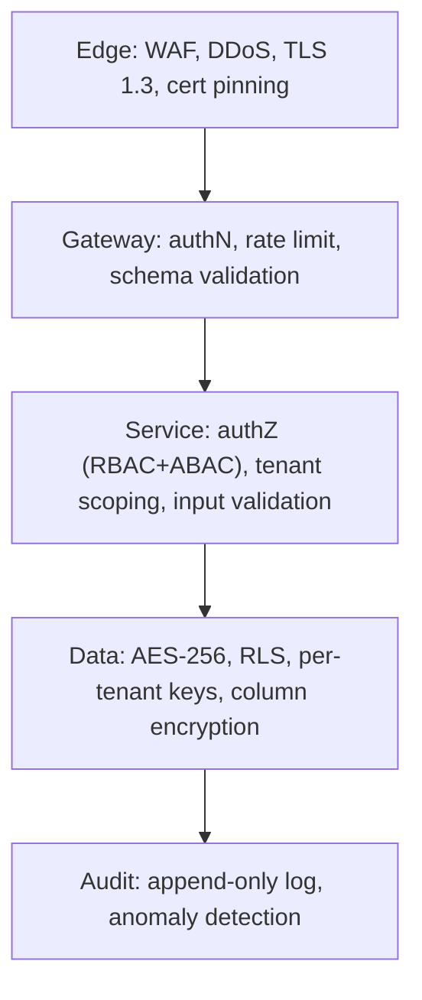

# 18 — Security & Compliance

[← Back to index](../README.md)

---

## 18.1 Defense in depth

## 18.2 Authentication & authorization

See [10 — Auth](10-auth.md). Summary: OTP + device binding (guards), email + MFA (admins), SSO (enterprise); JWT with short TTL + rotating refresh tokens; RBAC coarse + ABAC fine, re-checked server-side.

## 18.3 Encryption

| Layer | Standard |
|-------|----------|
| In transit | TLS 1.3 everywhere; mTLS service-to-service; cert pinning on mobile |
| At rest (PII) | AES-256 column encryption (Aadhaar hash, phone, bank) |
| At rest (storage) | SSE-KMS on all objects |
| Face embeddings | AES-256; vectors not reversible to photos |
| Keys | KMS/Key Vault; per-tenant data keys; annual rotation; no secrets in code |

## 18.4 Tenant isolation

- Application filters every query by `tenant_id`.
- PostgreSQL RLS is the backstop.
- Object storage prefixed per tenant; per-tenant encryption keys.
- Enterprise tenants may use a dedicated DB for physical isolation.

## 18.5 Audit & monitoring

- Every write emits an immutable `audit_log` entry (old/new value, actor, IP, timestamp), 7-year retention, append-only — undeletable even by Ultra Super Admin.
- PII access and data exports generate audit events.
- Security monitoring: anomalous-login alerts, new-geo-IP alerts, brute-force detection.

## 18.6 API & application security

- Strict input validation (schema + domain); output encoding; parameterized queries (no string-built SQL).
- Rate limiting per user/IP; idempotency on unsafe writes.
- Webhooks signed (HMAC-SHA256) and verified.
- Dependency, container, and secret scanning in CI (see [17](17-cicd.md)).

## 18.7 Mobile security

Certificate pinning, root/jailbreak detection (blocks offline attendance to defeat GPS spoofing), screenshot prevention on sensitive screens, biometric app lock, runtime tamper checks. See [05 §5.11](05-mobile-architecture.md).

## 18.8 Fraud controls

Attendance fraud scoring (Isolation Forest), liveness detection, GPS-spoofing detection via sensor cross-validation, device binding. See [12 §12.7](12-attendance.md).

## 18.9 Compliance

| Regime | Implementation |
|--------|----------------|
| **DPDP Act 2023** | Consent capture (esp. face data), data-subject access/correction/deletion via app, documented retention + automated archival/purge, data residency in India |
| **PSARA 2005** | Guard registers, training-certificate tracking, police-verification status workflow, deployment logs in PSARA-ready format |
| **PF / ESI** | Statutory calculation + EPFO/ESIC challan/ECR file generation |
| **State minimum wage** | Per-state wage tables, updated monthly, enforced in payroll |

## 18.10 Threat model (STRIDE summary)

| Threat | Example | Mitigation |
|--------|---------|------------|
| Spoofing | Proxy attendance | Device binding, face + liveness |
| Tampering | Altered evidence | SHA-256 hashing, versioned WORM storage |
| Repudiation | "I didn't approve that" | Immutable audit log with actor + IP |
| Information disclosure | Cross-tenant leak | App scoping + RLS + per-tenant keys |
| Denial of service | Flood at shift change | WAF rate limits, Kafka buffering, autoscale |
| Elevation of privilege | Forged permissions | Server-side authZ re-check, signed JWT |

## 18.11 Incident response (security)

Defined severities, on-call security rotation, runbooks, breach-notification process aligned to DPDP timelines, post-incident review with corrective actions tracked to closure.
