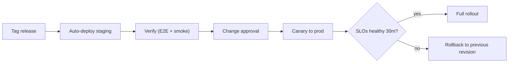

# 19 — Deployment Guide

[← Back to index](../README.md)

---

## 19.1 Prerequisites

- Cloud account (AWS or Azure) with org-level guardrails (SCPs/policies).
- Terraform ≥ 1.6, kubectl, Helm, Argo CD CLI, Docker.
- Access to secrets manager and container registry.
- DNS zone for `*.watchtower.app` and tenant custom domains.

## 19.2 Environment bootstrap (IaC)

```bash
# 1. Provision foundational infra (VPC, EKS, RDS, MSK, Redis, S3, KMS)
cd infra/terraform/envs/staging
terraform init
terraform plan -out plan.tfout
terraform apply plan.tfout

# 2. Configure kubectl against the new cluster
aws eks update-kubeconfig --name watchtower-staging --region ap-south-1

# 3. Install platform add-ons (ingress, cert-manager, Argo CD, observability)
helm upgrade --install platform ./infra/helm/platform -n platform --create-namespace
```

## 19.3 Application deployment (GitOps)

Argo CD watches the `deploy/` repo. Promotion = update the image tag in the environment's values file via PR; Argo CD reconciles.

```bash
# Promote a tested image to staging
yq -i '.image.tag = "1.4.2"' deploy/staging/values.yaml
git commit -am "deploy: attendance-svc 1.4.2 to staging" && git push
# Argo CD syncs automatically; watch rollout
argocd app wait watchtower-staging --health
```

## 19.4 Database migrations

```bash
# Expand-contract, online, backward-compatible
# Step 1 (expand): additive migration deployed BEFORE code that needs it
migrate -path ./migrations -database "$DB_URL" up
# Step 2: deploy code that writes both old+new
# Step 3 (contract): remove old columns AFTER all code uses new
```

Never run a blocking `ALTER` on large partitioned tables; use online tooling (`pg-osc`) and run during low-traffic windows.

## 19.5 Release process



## 19.6 Rollback

- Application: `argocd app rollback watchtower-prod <revision>` (image-immutable, instant).
- Database: forward-fix preferred; reversible migrations enable down-migration if safe.
- Feature kill-switch: disable a risky feature via flag without redeploy.

## 19.7 Smoke checklist (post-deploy)

- Auth: OTP send/verify, token refresh.
- Attendance: submit event → appears as PRESENT; offline batch sync.
- Patrol scan; incident create; SOS path (staging numbers).
- Dashboard loads within budget; report generates.
- Health/readiness green; error rate and latency within SLO.

## 19.8 Tenant onboarding (operational)

1. Xentrix provisions tenant + plan + entitlements (Xentrix Portal).
2. Configure white-label defaults.
3. Invite Tenant Owner; owner completes setup checklist (clients, sites, posts, shifts).
4. Bulk-import employees (template CSV) → document verification → device registration.
5. First roster published; attendance goes live.

## 19.9 Runbooks (linked from alerts)

- Kafka consumer lag spike, RDS failover, Redis eviction storm, AI GPU saturation, SMS provider outage, region failover (DR). Each runbook: detection, immediate mitigation, root-cause steps, escalation.
