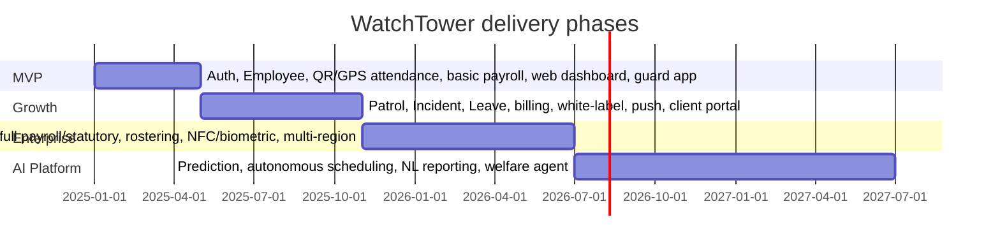

# 22 — Future Enhancements

[← Back to index](../README.md)

---

## 22.1 Delivery roadmap

## 22.2 Phase detail

### Phase 1 — MVP (Months 1–4)

- **Features:** OTP/email auth, employee onboarding, QR+GPS attendance with exception approval, fixed shifts, basic payroll, web dashboards (HR/Payroll/Org Admin), guard mobile app (attendance/schedule/payslip).
- **Team:** ~10 — 1 EM, 2 backend, 2 mobile, 1 web, 1 QA, 1 DevOps, 1 designer, 1 PM.
- **Deliverables:** 5 pilot tenants, 500+ guards, 90%+ digital attendance, zero critical payroll errors in 2 runs.
- **Risks:** low smartphone penetration (mitigate: supervisor bulk-mark, USSD plan); pilot data quality (mitigate: white-glove onboarding).

### Phase 2 — Growth (Months 5–10)

- **Features:** patrol management, incident + SOS, leave module, billing engine, white-label (logo/color), push notifications, client portal, real-time attendance dashboard, face recognition (beta).
- **Team:** ~18 — adds backend, mobile, web, a data engineer, second QA.
- **Deliverables:** 50 tenants, 10,000 guards.
- **Risks:** Kafka/ops maturity (mitigate: managed MSK, runbooks); face-recognition accuracy (mitigate: beta + fallback).

### Phase 3 — Enterprise (Months 11–18)

- **Features:** full AI fraud suite, production face recognition at scale, auto-rostering + conflict detection, full payroll with PF/ESI/gratuity, PSARA reporting, NFC + biometric hardware integration, multi-region DR, custom report builder.
- **Team:** ~30 — adds AI engineers, SRE, security engineer, integration engineers.
- **Deliverables:** 500 tenants, 100,000+ guards; 99.9% SLA.
- **Risks:** schema migration at scale (mitigate: online migrations); AI bias (mitigate: fairness audits).

### Phase 4 — AI-powered platform (Year 2–3)

- **Features:** incident prediction, demand forecasting, attrition v2 with interventions, autonomous rostering (human-approve), NL report generation, AI assistant, guard-welfare agent, vertical expansion (schools, hospitals, corporate, logistics), API marketplace, reliever marketplace.
- **Team:** ~45+ across pods (platform, AI, verticals, integrations).
- **Deliverables:** market-leading AI workforce platform; multi-vertical.
- **Risks:** model governance, data privacy at scale (mitigate: DPDP framework, model registry, audits).

## 22.3 AI roadmap

| Phase | AI features |
|-------|-------------|
| Y1 H1 | Face recognition, liveness, GPS-spoofing detection (rule-based) |
| Y1 H2 | Attendance anomaly detection, attrition v1, AI chat v1 |
| Y2 H1 | Incident prediction, performance scoring, AI shift scheduling |
| Y2 H2 | NL report generation, behavioral analysis, demand forecasting |
| Y3 | Autonomous rostering, predictive hardware maintenance, SLA-breach prediction, welfare agent |

## 22.4 Cost estimation (indicative, monthly, India region)

Order-of-magnitude only; actuals depend on traffic and reserved-capacity discounts.

| Scale | Compute (EKS) | Data (RDS+Redis+MSK) | Storage+CDN | AI (GPU) | 3rd-party (SMS/maps/WA) | Indicative total |
|-------|---------------|----------------------|-------------|----------|-------------------------|------------------|
| MVP (5 tenants) | low | low | low | minimal | usage-based | small (4–5 figures USD) |
| Growth (50) | medium | medium | medium | moderate | grows with guards | mid 5 figures |
| Enterprise (500+) | high | high (sharded) | high | significant | large | 6 figures |

Largest variable costs at scale: SMS/OTP volume, WhatsApp conversations, map requests, and GPU inference — all candidates for optimization (self-hosted face recognition, batched notifications, cached map tiles).

## 22.5 Best practices carried forward

1. Tenant isolation enforced at app + DB layers, always.
2. Event-driven core; the API never blocks on heavy downstream work.
3. Offline-first mobile; the field is the primary environment.
4. Compliance built into engines, not bolted on.
5. Everything as code; immutable artifacts; GitOps; auditable releases.
6. AI with governance: versioning, rollback, fairness audits, human override.
7. Observability and runbooks before scale, not after the first incident.
